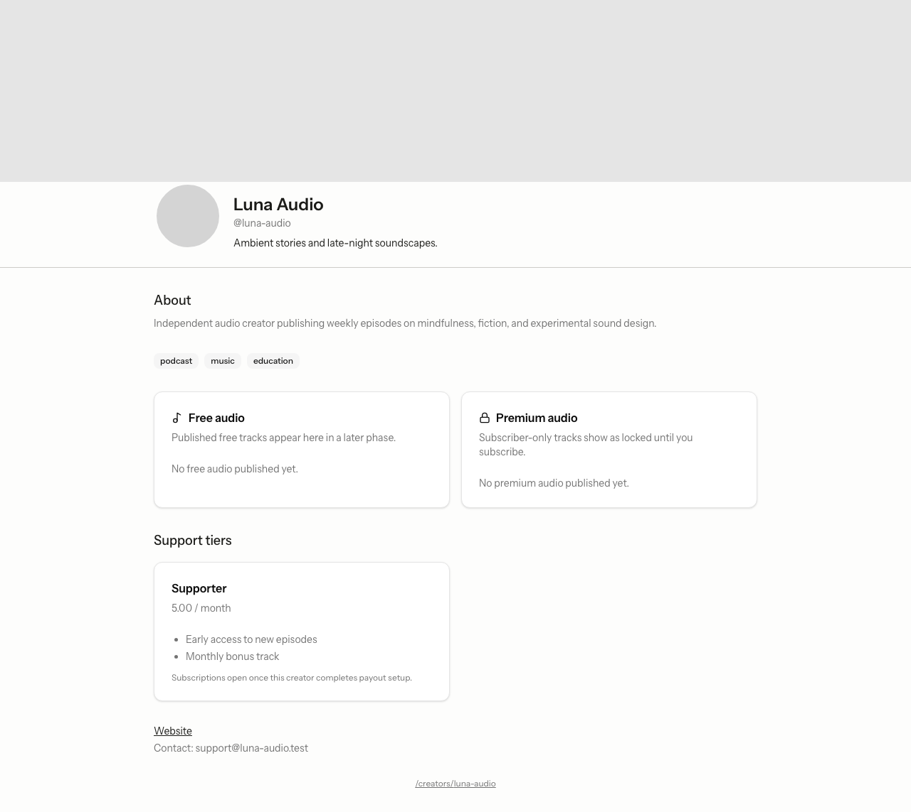
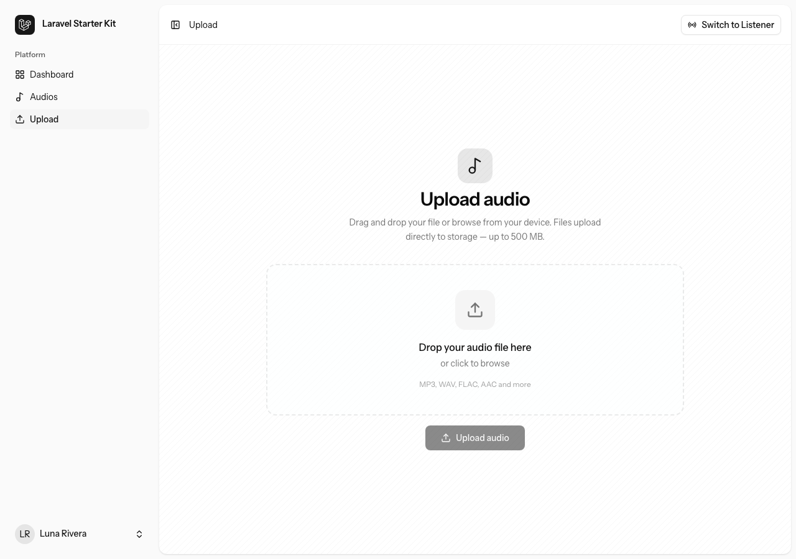
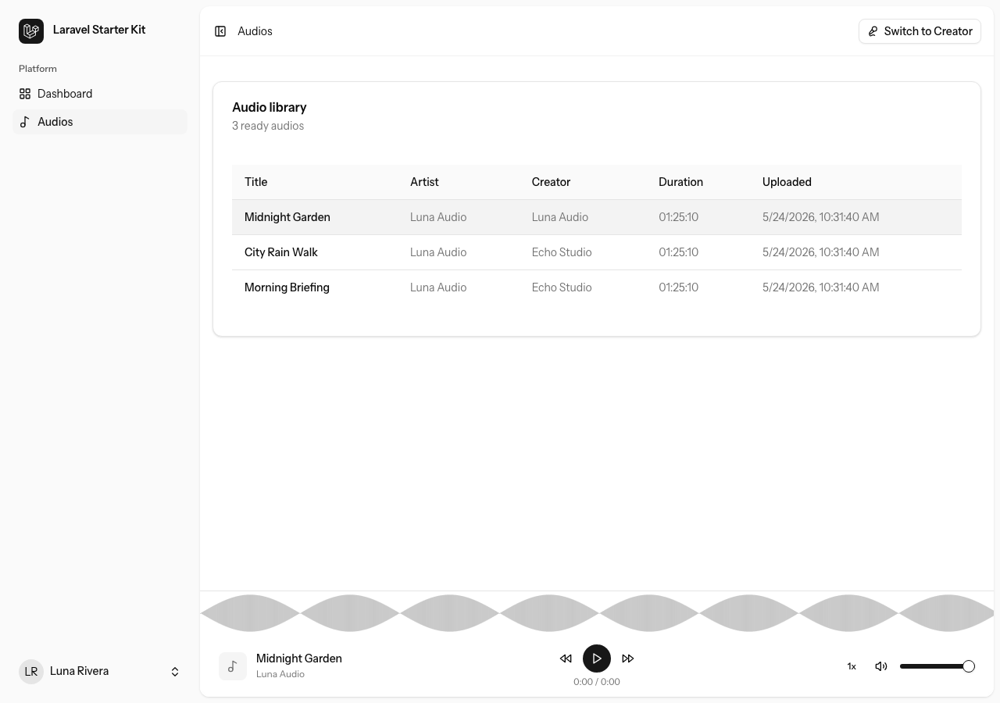
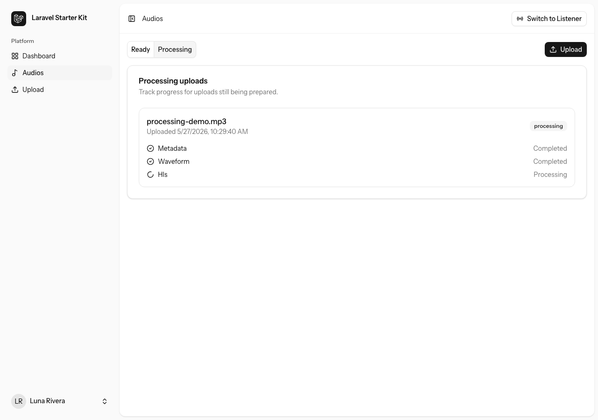
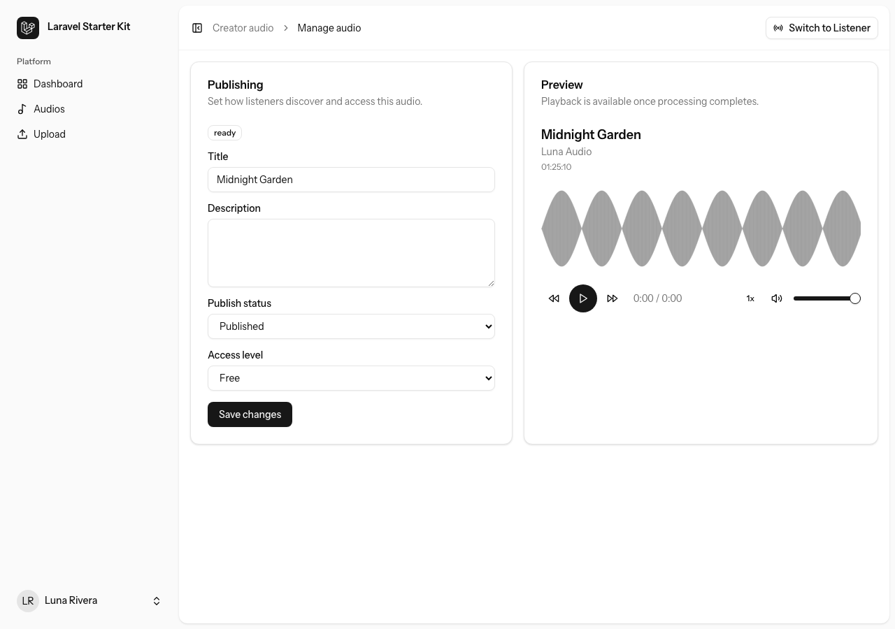
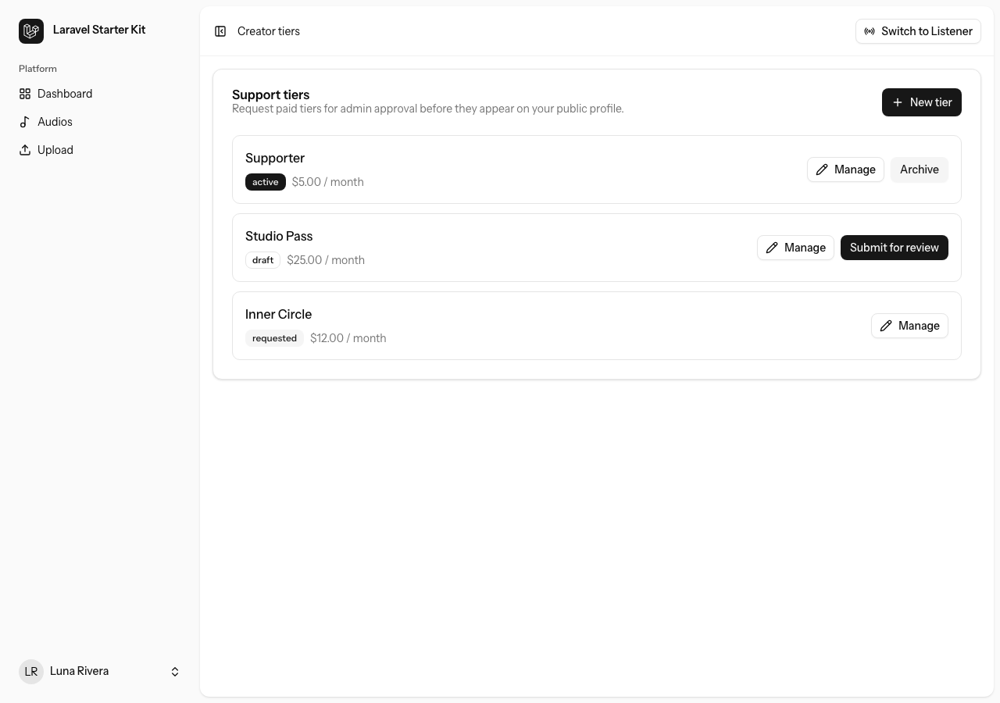
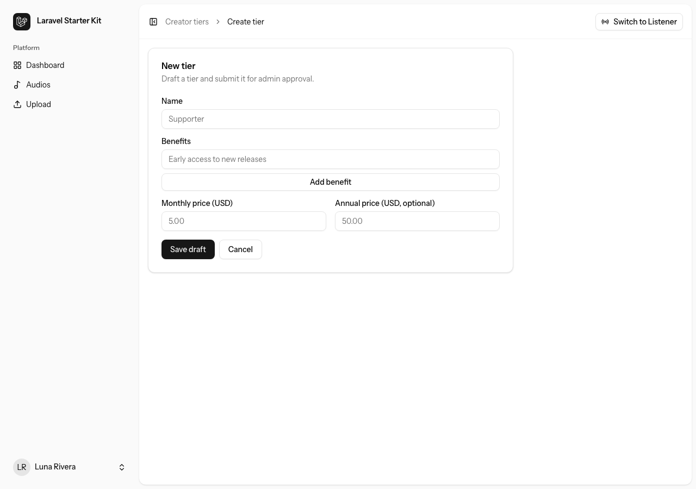
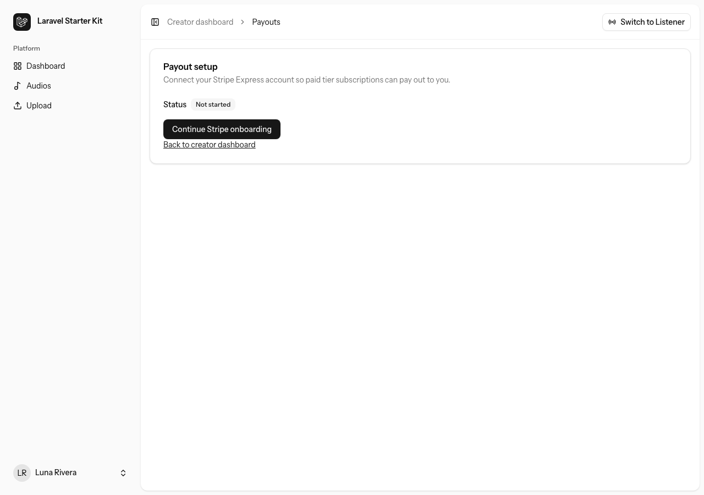

# Audio Upload

An audio platform for creators to upload, process, publish, and monetize audio — with a listener library featuring HLS streaming and waveform playback.

## Features

### Public creator profile

Share a branded public page with bio, categories, and support tiers so listeners can discover and subscribe.

- Public URL at `/creators/{handle}`
- Support tier cards with pricing
- Profile branding (avatar, cover, tagline, social links)



### Upload audio

Drag-and-drop audio files into the uploader. Files are sent to storage and enter the processing pipeline automatically.

- Drag-and-drop upload interface
- Signed URL upload flow
- Live processing status updates



### Audio library and player

Browse published audio from creators on the platform. Select a track to play it with the built-in HLS player and waveform visualization.

- Infinite-scroll audio library
- HLS streaming playback
- Waveform scrubbing



### Processing pipeline

Track uploads as they move through metadata extraction, waveform generation, and HLS transcoding.

- Ready and Processing tabs
- Per-step status indicators
- Automatic polling while jobs run



### Publish and manage audio

Set titles, access level (free or premium), and publish status once processing completes. Preview ready audio before publishing.

- Title and description editing
- Free vs premium access control
- Draft and published states



### Support tiers

Create paid support tiers, submit them for admin approval, and activate them on your public profile.

- Draft, requested, and active tier states
- Monthly pricing and benefits
- Submit and activate workflow



### Create tier

Define a new tier with name, price, and benefit list before submitting for review.

- Tier name and monthly price
- Benefits list
- Draft-first workflow



### Payout setup

Connect a Stripe Express account so paid tier subscriptions can pay out to you.

- Payout status overview
- Stripe Connect onboarding entry point
- Required before accepting paid subscribers



## Quick start

```bash
composer install
cp .env.example .env
php artisan key:generate
php artisan migrate
npm install
composer run dev
```

## Tech stack

- Laravel 13
- Inertia.js v3 + React 19
- Filament 5 (admin)
- Laravel Cashier + Stripe Connect
- Tailwind CSS v4
